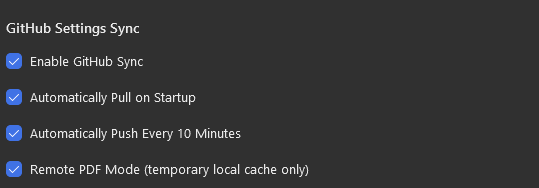
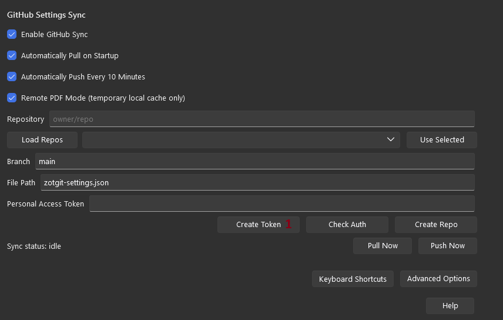
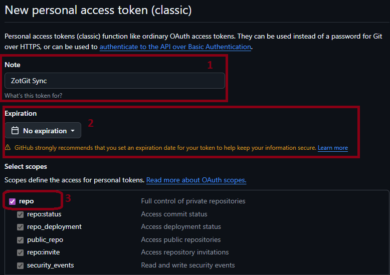
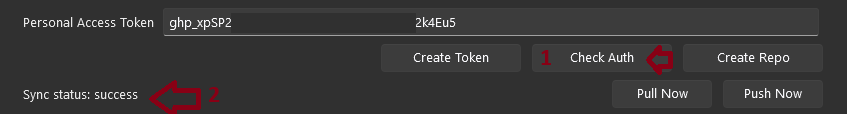
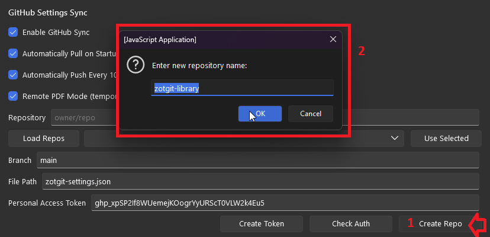
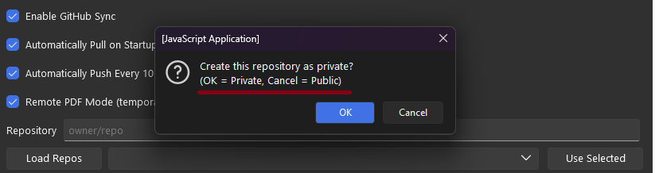
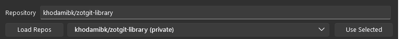
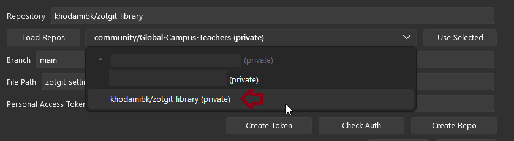
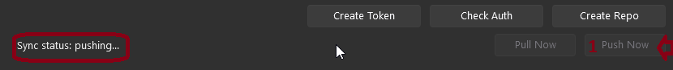

# ZotGit

A *simple* plugin for managing attachments in Zotero 7

## ℹ️ About ZotGit foundation

ZotGit is based on the foundation of [ZotMoov](https://github.com/wileyyugioh/zotmoov).

## ZotGit can:
- Automatically move/copy imported attachments into a custom directory
- Manually move/copy imported attachments to/from a custom directory via right-clicking
- Automatically delete linked attachments from your computer when you delete them in Zotero
- Easily attach the last modified file in a folder to a Zotero item

## Installation

[Download the latest release here](releases/latest)
Steps to install and properly use ZotGit:

1. Install Zotero 7 or later
2. Install ZotGit from the downloaded .xpi file (drag and drop into Zotero or use `Tools -> Add-ons -> Install Add-on From File`)
3. In Zotero, go to `Settings -> ZotGit Settings`

Here you will see few options which help you better use them:

 - ` Enable Github Sync`: Enables syncing settings and PDFs through GitHub
 - `Automatically Pull on Startup`: Pulls settings on Zotero startup
 - `Automatically Push Every 10 Minutes`: Pushes settings every 10 minutes; failed auto-push retries in 5 minutes; if you close the Zotero before a push or 10 minutes, ZotGit automatically pushes the latest settings on shutdown
 - `Remote PDF Mode`: With this enabled, GitHub is the persistent PDF source; pull skips bulk PDF download; PDFs are recalled on-demand when opening missing files; ZotGit performs a final push on shutdown, then removes the temporary cache folder
## How to setup ZotGit for the first time

- After installation you need to go to the `edit > Settings > Zotgit Settings`. This is where you can setup the ZotGit data directory and GitHub sync.

* Step 1: Generate a token for github sync
This option exist to allow you to synce your settings and PDFs across multiple devices and your chosen github repository.

When you press `creates token` it will redirect you to your github page where you can generate a token

and you must choose based on this photo and then copy your generated token 

after that, go back to Zotgit setting and insert your token in the `Personal Access Token` field and click `Check Auth` to make sure everything is working fine

4. If planning to sync across multiple devices, set the [Linked Attachment Base Directory](https://www.zotero.org/support/preferences/advanced#linked_attachment_base_directory) to the synced folder on each computer.

5. Next step is to create a repo, if you already have a repo you want to use, you can skip this step. Otherwise, create a new repository on github and copy the repo URL.

 
when you press `create repo`, you will see a pop-up window which asks you to name your repository and then when you press enter it asks you to choose the visibility of your repo by choosing between `public` and `private`

5.1. if you already have a repo, 

first press `Load repos` and from the list choose the repo you want to use 

and then press `Use Selected`.

6. after that you can press `Push Now` and after seeing the success message, you can check your repo to see if the files are there

7. Congratulations! You have successfully setup ZotGit for the first time. From now on, when you read add any paper to your Zotero library via [Zotero Connector](https://www.zotero.org/download/connectors), ZotGit will automatically move the attachment to the ZotGit data directory and link it to the Zotero item. 

8. Remember that ZotGit makes a temporary cache file and when you close your Zotero, it automatically pushes the latest settings to your GitHub repo and then deletes the cache folder. and When you want to read a paper, ZotGit checks if the file is missing and if it is, it pulls the file from GitHub and opens it.

### Bugs/Feature Requests

Both can be filed [here](https://github.com/Aaronkhodami/ZotGit/issues). Please keep feature requests tightly focused on the extension's core purpose of mooving attachments and linking them! if there is a fatal bug, or your have a feature request that is not directly related to the core purpose of the extension, please file it in the [Email Me directly ](mailto:khodamiaaron@gmail.com)